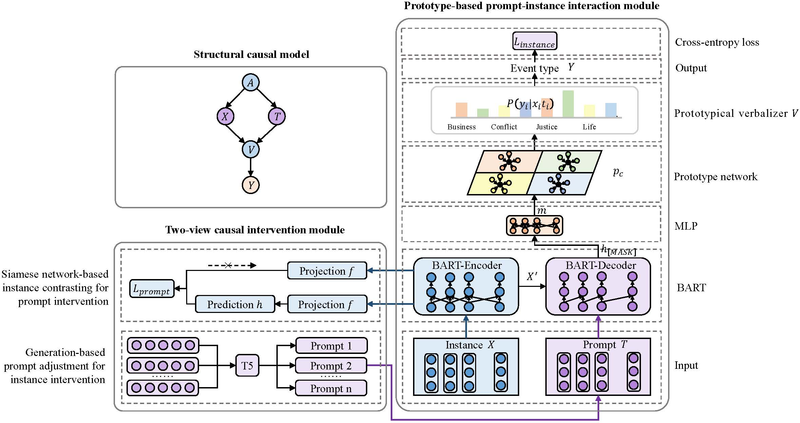

# Prototype-based Prompt-Instance Interaction with Causal Intervention for Few-shot Event Detection (2xInter)
# 基于提示交互和因果干预的小样本事件检测方法
This project includes the code implemented with PyTorch and the paper **Prototype-based Prompt-Instance Interaction with Causal Intervention for Few-shot Event Detection** published at The 2024 Joint International Conference on Computational Linguistics, Language Resources and Evaluation (**LREC-COLING 2024**).<br>
该工程为论文**基于提示交互和因果干预的小样本事件检测方法**的代码，该文章发表至**LREC-COLING 2024**会议。<br>
https://aclanthology.org/2024.lrec-main.1161.pdf



## 环境要求
 ```
pip install transformers
pip install pytorch_pretrained_bert
pip install scikit-learn
pip install qpth
pip install cvxpy
pip install loralib
pip install gpustat
 ```

## 主实验运行代码
### 1. 生成提示模板，生成模板的形式为“上下文+触发词+事件类型”：
 ```
python tools/generate_template_ace_argument.py --output_dir my_auto_template --task_name ACE --seed 13 21 42 87 100 --t5_model t5-3b --beam 100
 ```

### 2. 生成句子的提示模板的“bart token id”和“mask id”：
 ```
python ./datasets/template_multi_generate_argument_bart.py
 ```

### 3. 读取句子和提示模板的“bart token id”和“mask id”：
 ```
python fsl_bart_contra.py --dataset ace -n 5 -k 5 --encoder bart_contra_multipos --model proto_bart_contra --bert_pretrained /root/fsl-proact-main/bart-base
 ```

### 4. 我们的2xInter模型进行小样本事件检测任务：
1) RAMS数据集，5-way-5-shot设置（消耗显存：49651M）：
 ```
python fsl_bart_contra.py --dataset rams -n 5 -k 5 --encoder bart_contra_multipos --model proto_bart_contra --bert_pretrained /root/fsl-proact-main/bart-base
 ```

2) RAMS数据集，10-way-10-shot设置（消耗显存：65641M）：
 ```
python fsl_bart_contra.py --dataset rams -n 10 -k 10 --encoder bart_contra_multipos --model proto_bart_contra --bert_pretrained /root/fsl-proact-main/bart-base
 ```

3) ACE数据集，5-way-5-shot设置（消耗显存：39421M）：
 ```
python fsl_bart_contra.py --dataset rams -n 5 -k 5 --encoder bart_contra_multipos --model proto_bart_contra --bert_pretrained /root/fsl-proact-main/bart-base
 ```

4) ACE数据集，10-way-10-shot设置（消耗显存：39421M）：
 ```
python fsl_bart_contra.py --dataset rams -n 10 -k 10 --encoder bart_contra_multipos --model proto_bart_contra --bert_pretrained /root/fsl-proact-main/bart-base
 ```

## 消融实验代码
1)  “2xInter w/o DVCI”模型，对于ACE数据集，5-way-5-shot设置（消耗显存：16485M）：
 ```
python fsl_bart.py --dataset ace -n 5 -k 5 --encoder bart_base --model proto_bart --bert_pretrained facebook/bart-base
 ```

2)  “2xInter w/o II”模型，对于ACE数据集，5-way-5-shot设置（消耗显存：20515M）：
 ```
python fsl_bart.py --dataset ace -n 5 -k 5 --encoder bart_contra --model proto_bart --bert_pretrained facebook/bart-base
 ```

3)  “2xInter w/o PI”模型，对于ACE数据集，5-way-5-shot设置（消耗显存：37783M）：
 ```
python fsl_bart_contra.py --dataset ace -n 5 -k 5 --encoder bart_contra_multipos --model proto_bart_contra --bert_pretrained /root/fsl-proact-main/bart-base --PI_num 1
 ```
“PI_num”参数用于设置提示的数量，当“PI_num=1”时，一个样本仅拼接一个提示，因此为消融“提示干预模块”后的结果。


## 模型保存
checkpoints中保存的模型：https://drive.google.com/drive/folders/1Jonooj5luS8iPt5WH3t6Hsbf-YN5sbSo?usp=drive_link

## December 2024 update

1. Add *./datasets/ace/template_argument_multi_bart/template_argument_20230522.txt* file, which is prompt templates generated by T5. We use the “https://github.com/princeton-nlp/LM-BFF” project to generate the prompt template. <br>
**Specifically**, we convert the dataset (e.g., ACE) into **“context + trigger word + event type”** and feed it to the project's T5 to generate a series of templates.

2. Add *./datasets/template_multi_generate_argument_bart.py* file, which generates prompts for each sample using the prompt template.
